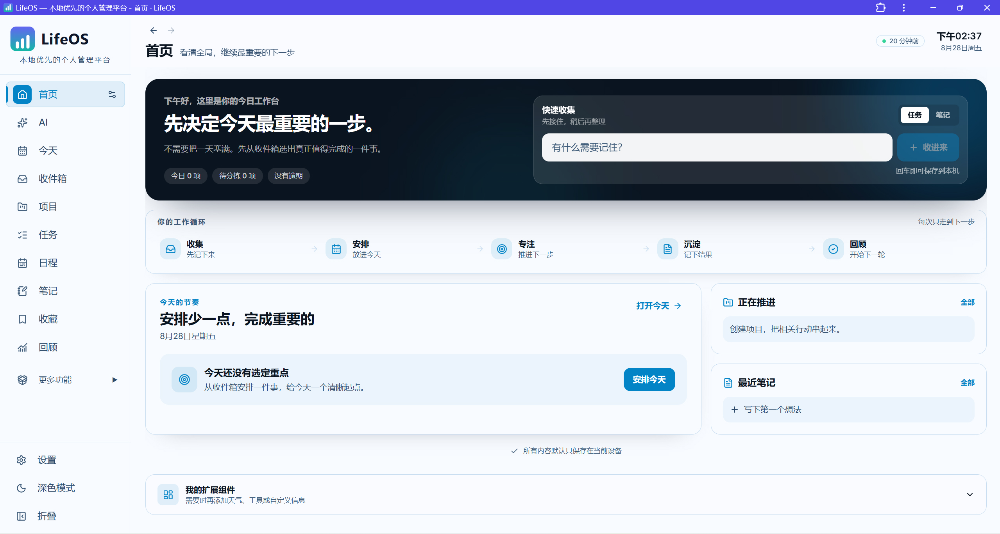

# LifeOS

<p align="center">
  
</p>

<p align="center">
  <strong>本地优先的个人工作与生活中枢</strong><br>
  收集 → 安排 → 专注 → 沉淀 → 回顾
</p>

<p align="center">
  <a href="LICENSE"></a>
  
  
  
</p>

<p align="center">
  
</p>

<p align="center"><sub>当前 LifeOS 首页</sub></p>

**LifeOS** 是一个 local-first 的个人管理应用。任务、日程、项目、笔记、收藏、回顾和 AI 管理统一围绕一条日常工作流组织，而不是把所有能力同时堆在界面上。

核心数据保存在当前浏览器 / PWA 的本地存储中；LifeOS 本身没有账户系统、业务后端或云同步服务。只有当你主动使用 AI、天气、外部链接预览等联网能力时，相关请求才会发往对应第三方服务。

> 当前产品形态：**Web + 可安装 PWA**。仓库目前没有 Electron / Tauri，因此不会直接生成 `.exe`、`.dmg` 或 `.AppImage`。

---

## 当前体验

### 主导航

| 模块 | 当前定位 |
| --- | --- |
| 首页 | 看清全局，并决定今天最重要的下一步 |
| AI | 用自然语言查询、安排和整理 LifeOS 数据 |
| 今天 | 安排当天真正要完成的事项 |
| 收件箱 | 处理尚未决定项目 / 日期的输入 |
| 项目 | 围绕结果、里程碑和下一步推进 |
| 任务 | 管理已经明确、可执行的工作 |
| 日程 | 管理有具体时间承诺的事件与时间块 |
| 笔记 | 记录、整理和关联长期知识 |
| 收藏 | 保存外部资料，并可转成任务或笔记 |
| 回顾 | 查看最近的工作记录与变化 |

### 更多功能

按需展开：时间统计、番茄钟、专注模式、习惯、甘特图、知识图谱、自动化、每周回顾、项目组合、精力追踪、空闲时间、文档中心。

旧版电子表格、演示文稿、绘图和表单不再提供运行时编辑器或直达路由。历史持久化数据结构仅作为兼容数据保留，不会被清理迁移主动删除。

第一次使用可以从首页顶部横幅一键加载示例数据「小张的一周」，跑通完整工作流后再一键删除；加载只合并不覆盖。

---

## 核心工作流

```text
收集 → 安排 → 专注 → 沉淀 → 回顾
```

- **收集**：首页快速收集或收件箱接住还没想清楚的内容。
- **安排**：决定项目、截止日期、今天是否要做，或放进具体日程。
- **专注**：任务、专注模式、番茄钟和时间统计协同完成执行。
- **沉淀**：把过程、结果、链接和经验放进笔记与收藏。
- **回顾**：通过活动记录和每周回顾看清完成了什么、还剩什么。

收件箱和任务已经分开：**收件箱 = 未决定；任务 = 已承诺 / 可执行**。任务看板不会再重复展示 backlog 收件箱列。

---

## AI：默认少打断，重要操作仍确认

LifeOS 当前实现了 **60 个 AI 管理工具**，覆盖任务、日程、笔记、项目、收藏、自动化、习惯、精力、时间统计、专注、每日目标、例行、资源和任务模板。

AI 页面有两种使用方式：

- **工具模式**：允许 AI 查询并操作 LifeOS 数据。
- **聊天模式**：用于写作、分析、代码等普通对话，不解析 LifeOS 操作。

执行权限有三档：

| 模式 | 行为 |
| --- | --- |
| 自动执行 | **新用户默认**。可撤销的本地写操作直接执行，并写入操作记录 |
| 每次确认 | 写操作先显示确认卡片 |
| 只读 | 允许查询，阻止所有写操作 |

即使处于自动执行，`delete_task`、`delete_event`、`delete_note`、`delete_time_entry`、`delete_routine` 仍会强制确认。已执行操作会进入 AI 操作记录；支持的操作可查看结果并撤销。

AI 的交互原则是：**优先自行查询消歧；对可合理推断且可撤销的操作直接行动；只有真正高风险或无法消歧时才追问。**

当前内置提供商：OpenRouter、Groq、Hugging Face、Mistral AI、Google Gemini、OpenAI、Anthropic、xAI、DeepSeek。部分提供商受浏览器 CORS 限制，界面会标记是否需要代理。当前代码**没有 Ollama provider**，文档不会把 Ollama 描述成已实现能力。

详见 [AI 管理指南](docs/ai.md)。

---

## 本地数据与隐私

- 主要业务数据通过 **IndexedDB / Dexie** 保存；部分 UI 偏好使用 localStorage。
- 数据属于**浏览器 origin**。例如 `http://localhost:5173` 与 `http://localhost:4173` 是两个不同的数据空间。
- 清除该站点的浏览器数据会删除本地数据，请定期备份。
- `.brain` 全量备份不包含 AI API key。
- Chromium 系浏览器可以选择本机文件夹做自动备份；如果该文件夹由 OneDrive / iCloud / Google Drive 等客户端同步，上传行为由云盘客户端完成，不是 LifeOS 上传。
- AI API key 使用设备管理的本地密钥加密保存；跨模块上下文默认由用户显式开启后才会发送给所选 AI 提供商。

详见 [备份与恢复](docs/backup-sync.md) 和 [隐私与安全](docs/privacy-security.md)。

---

## 运行

### 环境

- Node.js **22**（见 `.node-version`）
- npm

### 开发模式

```bash
npm ci
npm run dev
```

默认访问：`http://localhost:5173`

开发模式下 PWA Service Worker 被关闭，避免缓存干扰开发。

### 生产构建与 PWA

```bash
npm run build
npm run preview
```

默认预览地址：`http://localhost:4173`

`npm run preview` 使用生产构建，因此可以测试 PWA 安装。Chrome / Edge 不一定自动弹窗；通常从地址栏安装图标或浏览器菜单选择“安装 LifeOS”。

> 如果 PWA 安装自 `localhost:4173`，长期可靠使用时仍需要这个本地地址有服务响应。关闭浏览器普通标签页没关系，但停止本地 preview / 静态服务器后，不应假设所有页面都能仅靠缓存长期正常工作。

完整说明见 [PWA 安装与本地使用](docs/install-pwa.md)。

---

## 质量检查

普通 CI 在 Pull Request 和 `main` push 时统一运行：

```bash
npm run ci
```

该命令包含 lint warning budget、仓库卫生、源码尺寸、TypeScript、单元测试、设计 token、浏览器测试清单和生产构建。完整 Playwright 浏览器矩阵由 GitHub Actions 的 **Hosted browser tests** 手动工作流运行。

---

## 技术栈

React 19 · TypeScript 5.9 · Vite 7 · Tailwind CSS 4 · Zustand 5 · Dexie / IndexedDB · Vitest · Playwright · vite-plugin-pwa · Lexical / Tiptap · D3 / Recharts

关键目录：

- `src/config/features.ts`：功能分层与主导航唯一注册表
- `src/components/dashboard/`：首页固定工作流
- `src/widgets/`：可选扩展组件
- `src/services/ai/agent/`：AI 工具协议、执行器、提示词与撤销
- `src/stores/`：本地状态与持久化
- `src/db/`：Dexie 数据层
- `docs/`：应用内用户文档
- `docs/technical/`：开发者文档，不打包进普通文档中心

---

## 文档

- [快速入门](docs/getting-started.md)
- [PWA 安装与本地使用](docs/install-pwa.md)
- [AI 管理指南](docs/ai.md)
- [核心工作流](docs/workflow.md)
- [日程、专注与时间](docs/schedule-and-focus.md)
- [笔记与收藏](docs/knowledge.md)
- [备份与恢复](docs/backup-sync.md)
- [键盘快捷键](docs/keyboard-shortcuts.md)
- [故障排除](docs/troubleshooting.md)
- [AI 架构（开发者）](docs/technical/AI_ARCHITECTURE.md)

---

## Repository workflow

日常开发使用短生命周期分支 → PR → CI → squash merge → 删除分支。长期规则见 [CONTRIBUTING.md](CONTRIBUTING.md)，仓库当前状态以 GitHub Settings 为准。

---

## License

LifeOS 以 [MIT License](LICENSE) 发布。

LifeOS initially derives from [NeumanOS](https://github.com/travisjneuman/neumanos). Attribution is retained in [NOTICE.md](NOTICE.md).
